# FishStudio — Premium Meat & Fish E-Commerce Platform

A full-stack, multi-vendor e-commerce platform for the Indian meat & fish market,
built as a **Turborepo monorepo** with a microservices architecture: instant-delivery
UX, real-time order tracking, and three role-specific dashboards.
 
---

## Executive Summary

**The problem.** Fresh fish and meat is a perishable, weight-variable, hyper-local
category. Stock is measured in kilos that change as a fish is cut, a "1.1 kg rohu"
is a different SKU from a "1.4 kg rohu", and a store can only serve a handful of
pincodes. Generic e-commerce platforms model none of this: they assume fixed SKUs,
unlimited catalog reach, and stock that doesn't evaporate at the end of the day.

**Who it's for.**

| Role | What they do |
|---|---|
| **Customers** | Browse by locality, order with a delivery slot (instant / morning / evening), track the order live |
| **Sellers** | Run one store: pricing, per-size stock, combos, flash sales, staff sub-accounts |
| **Admins** | Own the master catalog, approve sellers, review banners, monitor orders and payments across every store |

**The core differentiator** is the **catalog + variant** model. Admin owns one
canonical product record (name, images, nutrition, cooking tips, slug); each seller
attaches a lightweight variant carrying only their own price, stock and cutting
options. Customers therefore see one clean product page per fish rather than nine
near-duplicate listings, search deduplicates to the cheapest nearby variant, and
slugs can't collide across stores.

**Why this architecture.** Three constraints drove the shape of the system:

1. **The catalog and the ledger want different databases.** Product documents are
   deeply nested and change shape often (size pricing, cutting types, per-size stock)
   — a natural fit for MongoDB. Orders and payments need transactions, exact decimal
   money, and constraints — that's PostgreSQL. The system uses both, and the
   interesting engineering is in the seam between them (see
   [Checkout Consistency](#checkout-consistency)).
2. **Overselling is unacceptable and un-undoable.** You cannot un-sell the last fish.
   Stock is decremented with atomic conditional updates *before* the order commits,
   with a reservation record and sweeper covering the crash window.
3. **Perceived speed is the product.** For a 30-minute delivery promise, a 2-second
   page load reads as broken. Hence streaming SSR, intent prefetching, aggressive
   caching with stampede protection, and pre-created payment orders.

**Honest scope.** This is a portfolio-scale system built to production *patterns* —
transactional outbox, idempotent webhooks, serializable retries, partial indexes. It
has **no automated tests and no metrics or tracing stack**; see
[Testing](#testing) and [Observability](#observability) for exactly what exists and
what doesn't.

---

## Table of Contents

**Start here** → [Executive Summary](#executive-summary) · [Key Tradeoffs](#key-tradeoffs) · [Checkout Consistency](#checkout-consistency)

**Orientation**
1. [What This App Does](#what-this-app-does)
2. [How the App Works (Architecture)](#how-the-app-works)
3. [Tech Stack](#tech-stack)
4. [Project Structure](#project-structure)

**Design & decisions**

5. [Key Tradeoffs](#key-tradeoffs)
6. [Database Schema](#database-schema)
7. [Authentication & Authorization](#authentication--authorization)
8. [Checkout Consistency](#checkout-consistency) — *sequence diagrams*
9. [Performance: Where & How](#performance-where--how)

**Subsystems**

10. [Real-Time: WebSockets](#real-time-websockets)
11. [Search: Meilisearch](#search-meilisearch)
12. [Message Queue: RabbitMQ](#message-queue-rabbitmq)
13. [Image Handling](#image-handling)
14. [Email / SMS / Push Notifications](#email--sms--push-notifications)

**Running it in production**

15. [Testing](#testing)
16. [Observability](#observability)
17. [Failure Handling](#failure-handling)
18. [Capacity Targets & Limits](#capacity-targets--limits)
19. [Docker & Deployment](#docker--deployment)
20. [Getting Started (Local Dev)](#getting-started-local-dev)

**Appendices**

- [A — All API Routes](#appendix-a--all-api-routes)
- [B — Frontend Routes](#appendix-b--frontend-routes)
- [C — Environment Variables](#appendix-c--environment-variables)

---

## What This App Does

FishStudio is a **multi-vendor e-commerce platform** for premium seafood and meat with three distinct user roles:

- **Customers** browse products, search by category, add to cart, checkout, track orders in real time, and manage saved addresses.
- **Sellers** manage their store, create/list products from a catalog, upload banners, run discount events, view analytics, and manage staff.
- **Admins** approve sellers, manage the global product catalog, review banners, issue signup access codes, monitor all orders and payments across sellers, and configure categories.

Key capabilities:
- OTP-based user login (phone/email) — no passwords for shoppers
- Catalog + store-variant product model (admin creates master catalog, sellers create their own pricing/stock variants)
- Real-time order status updates via WebSocket
- Meilisearch-powered product search with typo-tolerance and Redis caching
- Razorpay + COD payment support, with webhook reconciliation and admin/seller refunds
- India-specific: 6-digit pincode serviceability checks, city/delivery-time configuration per store
- Seller-controlled events (flash sales, free delivery, bulk discounts)
- Staff sub-accounts with granular access under a seller

---

## How the App Works

### System map

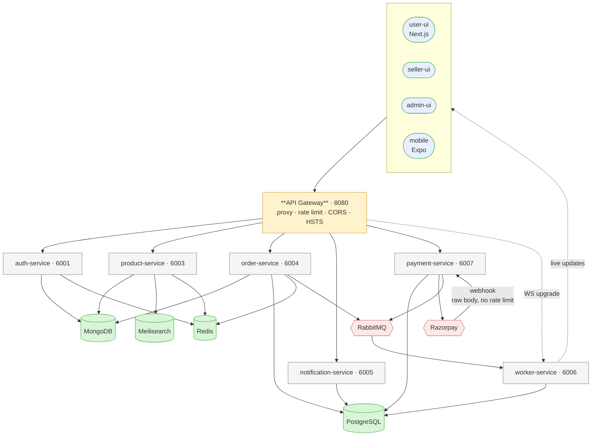

| Service | Port | Owns | Stores |
|---|---|---|---|
| api-gateway | 8080 | Single entry point, WS upgrade forwarding | — |
| auth-service | 6001 | Users, sellers, staff, stores, serviceability | Mongo, Redis |
| product-service | 6003 | Catalog, variants, search, banners, coupons, combos | Mongo, Meili, Redis |
| order-service | 6004 | Checkout, stock reservation, order lifecycle, stats | Postgres + Mongo |
| notification-service | 6005 | In-app notification feed | Postgres |
| worker-service | 6006 | WebSocket rooms, queue consumers, outbox relay | Postgres |
| payment-service | 6007 | Razorpay orders, webhooks, refunds, reconciliation | Postgres |

> Razorpay webhooks hit `/payment/api/webhook`, which **bypasses the JSON body parser
> and the rate limiter** — the raw body is needed for signature verification, and
> throttling a gateway retry would strand a real payment.

### Monorepo Structure

Managed by **Turborepo** with **Bun** as the package manager. Build order is resolved by dependency graph — shared packages are compiled before apps.

```
fishStudio/
├── apps/
│   ├── api-gateway/          # Express HTTP proxy (port 8080)
│   ├── auth-service/         # Authentication, users, sellers, staff (port 6001)
│   ├── product-service/      # Catalog, search, banners, coupons (port 6003)
│   ├── order-service/        # Orders, checkout, stats (port 6004)
│   ├── notification-service/ # In-app notifications (port 6005)
│   ├── worker-service/       # WebSocket server + RabbitMQ consumers + outbox relay (port 6006)
│   ├── payment-service/      # Razorpay orders, webhooks, refunds (port 6007)
│   ├── mobile/               # Expo / React Native app
│   ├── user-ui/              # Next.js 16 consumer storefront (port 3000)
│   ├── seller-ui/            # Next.js 16 seller dashboard (port 3002)
│   └── admin-ui/             # Next.js 16 admin panel (port 3001)
│
└── packages/
    ├── db-mongo/             # Prisma client + schema for MongoDB
    ├── db-postgres/          # Prisma client + schema for PostgreSQL
    ├── env-config/           # Centralized env variable loader
    ├── error-handlers/       # Custom error classes + Express middleware
    ├── eslint-config/        # Shared ESLint rules
    ├── jobs/                 # CronManager for scheduled tasks
    ├── libs/                 # Redis, RabbitMQ, Cloudinary, OTP, Meilisearch, cache helpers
    ├── pricing/              # Single cart-total formula shared by web, mobile and server
    ├── middlewares/          # JWT auth + role-based access middleware
    ├── typescript-config/    # Shared tsconfig bases
    ├── ui/                   # Shared Shadcn UI components
    └── zod-schema/           # Shared Zod validation schemas & TypeScript types
```

---

## Tech Stack

### Frontend

| Layer | Technology |
|---|---|
| Framework | Next.js 16.2 (App Router, React Server Components) |
| Runtime | React 19.2 |
| Build / HMR | Turbopack |
| UI Primitives | Shadcn UI (Radix UI) |
| Animations | Framer Motion |
| Styling | Tailwind CSS 3.4 |
| State | Zustand (cart, auth, addresses) |
| Data Fetching | TanStack Query v5 (React Query) |
| Forms | React Hook Form 7 + Zod |
| Charts | Recharts + ApexCharts |
| HTTP Client | Axios |
| Rich Text Editor | react-quill-new (admin) |
| Toast | Sonner |
| Dark Mode | next-themes |
| Carousel | Embla Carousel |
| Maps | react-simple-maps |
| Date Utilities | date-fns 4 |

### Backend Services

| Layer | Technology |
|---|---|
| Runtime | Node.js 18+ |
| Framework | Express.js 5.2 |
| Language | TypeScript 5.9 |
| Bundler | tsup |
| Executor (dev) | tsx |
| Password Hashing | Argon2 |
| JWT | jsonwebtoken |
| Request Security | helmet, express-rate-limit |
| HTTP Proxy | express-http-proxy (API Gateway) |
| Logging | morgan |
| Validation | Zod |

### Databases

| Store | Technology | Purpose |
|---|---|---|
| MongoDB | Prisma ODM | Users, sellers, staff, stores, products catalog, images, banners, events, coupons, combos |
| PostgreSQL | Prisma ORM | Orders, order items, payments, coupon usages, notifications, audit log, outbox, stock reservations |

Hybrid read/write: product catalog lives in MongoDB (flexible schema), transactional order data lives in PostgreSQL (ACID guarantees).

Because the two cannot share a transaction, checkout uses a **stock reservation record** plus a **transactional outbox** to stay consistent across them — see [Checkout Consistency](#checkout-consistency).

### Infrastructure

| Layer | Technology |
|---|---|
| Cache | Redis (ioredis 5) — auth tokens, search results, OTP |
| Search | Meilisearch 0.47 — full-text, typo-tolerant product search |
| Message Queue | RabbitMQ 3 — async OTP delivery, order event broadcasting |
| CDN / Images | Cloudinary |
| Payments | Razorpay (orders, signature verification, webhooks, refunds) |
| Email | Nodemailer (SMTP) or Brevo API |
| SMS | Fast2SMS API |
| Push Notifications | Expo Server SDK 3.11 |
| Containers | Docker Compose |
| CI/CD | GitHub Actions → Docker Hub → SSH deploy to Droplet |
| Monorepo | Turborepo |
| Package Manager | Bun 1.3.10 |

---

## Project Structure

### Backend Services Roles

#### `apps/api-gateway`
Single entry point for all HTTP traffic. Uses `express-http-proxy` to forward requests to internal services. Handles WebSocket upgrade forwarding to the worker service. Applies global rate limiting.

#### `apps/auth-service`
Owns all identity: user OTP login, seller/admin registration, staff sub-accounts, store creation, pincode serviceability, seller approval flow. Uses Argon2 for password hashing, JWT for sessions, Redis for token caching.

#### `apps/product-service`
Product catalog management, store variant creation, Meilisearch indexing, Redis-cached search, category/subcategory config, coupon management, seller banner uploads + admin review, seller flash-sale events, image uploads to Cloudinary. Runs an hourly cron to hard-delete soft-deleted products past their grace period.

#### `apps/order-service`
Creates orders, validates cart contents and pincode serviceability, reserves stock, lets sellers accept/reject/update order status, provides stats and analytics for sellers and admins. Owns the checkout transaction and the stock-reservation sweeper.

#### `apps/payment-service`
Everything that touches the payment gateway: creating Razorpay orders and binding them to a payment row, verifying the checkout signature, handling webhooks (capture, failure, refund), issuing refunds for admins and sellers, and a reconciliation job that resolves payments left PENDING. Consumes `PAYMENT_EVENTS` to create the gateway order ahead of the customer tapping Pay.

#### `apps/notification-service`
Stores in-app notifications in PostgreSQL, exposes endpoints to fetch and mark as read. Consumes events from RabbitMQ to create notification records.

#### `apps/worker-service`
Runs a raw WebSocket server (no Socket.io). Consumes RabbitMQ queues and broadcasts messages to connected clients segmented into rooms (by `storeId`, `sellerId`, `staffId`, `userId`, `adminId`). Also runs the OTP worker (sends SMS/email from queue).

---

## Key Tradeoffs

Every choice buys something and costs something. The **cost** column is the honest part.

| Decision | Bought | Cost |
|---|---|---|
| **Two databases**<br/>Mongo catalog + Postgres ledger | Nested product docs that change shape freely; real transactions and exact money where it matters | No cross-DB transaction — the reservation, outbox and sweeper exist *only* because of this. No FK integrity on `userId`/`storeId`/`productId`. Every order list needs a second hop to Mongo |
| **Raw `ws`**<br/>not Socket.IO | Tiny client bundle, no protocol overhead, for one-directional server→client JSON | No auto-reconnect, no transport fallback; rooms and heartbeat are hand-maintained. Blocked upgrades mean no updates, not degraded ones |
| **Meilisearch**<br/>not DB search | Typo tolerance ("rohu"/"rohru"/"roho"), custom ranking, single-digit ms | A second copy that can drift, a sync worker, another service to run. New products aren't instantly searchable |
| **Catalog + variant**<br/>not independent products | One clean page per fish, no slug collisions, dedup search, content authored once | Every read is two queries + an in-memory merge. That merge is untyped, so a dropped projection field fails at runtime. Sellers can't diverge from catalog copy |
| **Serializable**<br/>on checkout | "Two people can't spend the last coupon use" without hand-rolled locking | Conflicts abort transactions, so the retry loop is **mandatory**; every extra query inside the txn measurably raises the conflict rate |
| **Decimal + number boundary** | Exact storage and SQL sums, without decimal.js in the RN bundle | A boundary that must be respected — forget `toMoney()` and the field silently serializes as a string |

> **Would I choose two databases again?** At this scale, probably not. One Postgres with
> `jsonb` for the flexible product fields would be simpler and faster, and would delete
> most of the consistency machinery above. The split is defensible, but it was chosen
> earlier than the data justified.

---

## Database Schema

Two databases, split by what the data *needs* rather than what it *is*: flexible
nested documents in Mongo, transactions and exact money in Postgres.

### MongoDB — identity & catalog

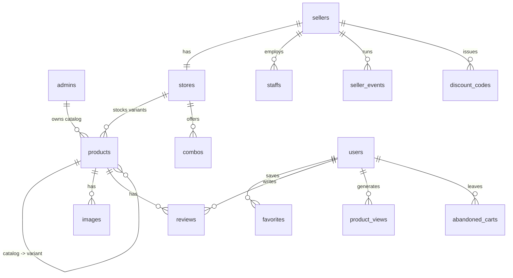

| Collection | Carries |
|---|---|
| **users** | phone/email, name, avatar, address book, `referralCode` / `referredByCode` |
| **sellers** | credentials (Argon2), `isApprovedByAdmin`, `isActive` kill-switch, permissions |
| **staffs** | sub-accounts under a seller |
| **stores** | address, pincode, hours, `servicePincodes[]`, `areaPincodes{}`, `areaCities{}`, instant-delivery config |
| **admins** | owns the master catalog, coupons, banners |
| **products** | *both* catalog roots and store variants — `catalogProductId` links them; pricing maps, `trackStockPerSize` + `sizeStock[]`, `totalSold`, soft-delete |
| **images** | Cloudinary `file_id` + URL, typed PRODUCT / USER_AVATAR / STORE_AVATAR |
| **discount_codes** | type, value, `maxUses`, `maxUsesPerUser`, `isFirstOrder`, `restrictedToUserId` |
| **combos** | fixed bundle at one price; each item pins productId + qty + optional variant |
| **banners** / **seller_events** | merchandising and flash sales, with approval status |
| **site_config** | categories, subcategories, per-category active flags |
| **abandoned_carts** / **product_views** | reminder job input; recently-viewed + recommendations (90-day TTL) |

> `sizeStock` is an **array of `{size, qty}`, not a map** — size labels like `"1.1 kg"`
> contain dots, which Mongo would read as nested-path separators. As an array the size
> is only ever compared, never used as a path segment, which is what allows an atomic
> `$inc` via `arrayFilters`.

### PostgreSQL — orders, money, reliability

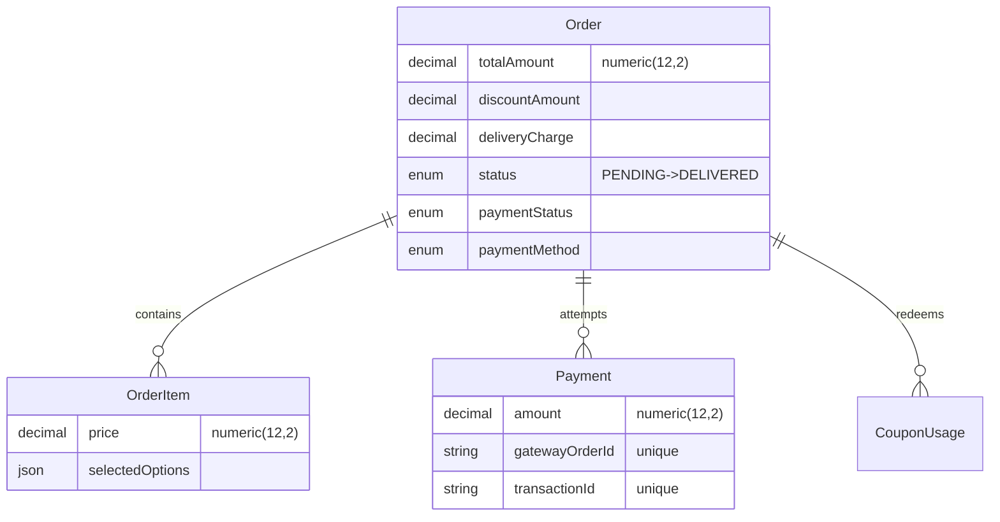

Standalone reliability tables — no FK to `Order`, because they must survive
independently of it:

| Table | Purpose | Pruned |
|---|---|---|
| **AuditLog** | Append-only financial trail (`entityType`, `action`, `actorType`, metadata) | Never |
| **WebhookEvent** | Every gateway webhook, deduped on `(provider, eventId)`; `processedAt` null = received, not yet applied | 30 d |
| **OutboxEvent** | Written in the same txn as the state change; drained to RabbitMQ; `lockedAt`/`lockedBy` claim | 30 d |
| **StockReservation** | Records a Mongo decrement so a crash can't leak stock | 30 d |
| **Notification** | In-app feed, cursor-paginated | — |

#### Money is `Decimal`, never `Float`

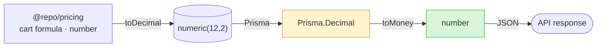

**Decimal at rest and in SQL, plain `number` at the edges.** `toMoney()` / `toDecimal()`
(`packages/db-postgres/src/money.ts`) are the only sanctioned crossings.

| 1000 × ₹0.07 | Result |
|---|---|
| `double precision` | `69.99999999999966` |
| `numeric(12,2)` | `70.00` |

Float totals drift against Razorpay, which settles in integer paise. Two traps: a raw
`Prisma.Decimal` JSON-encodes as a **string** (silent contract break), and the shared
cart formula stays `number` so decimal.js never reaches the React Native bundle.

#### Index strategy

| Rule | Why |
|---|---|
| No standalone index already covered by a compound | Both engines use the **leftmost prefix**; the extra index is pure write cost |
| Sweeper tables use **partial** indexes | Small hot set inside a forever-growing table — index stays proportional to the backlog, not to all history |
| Partial indexes live in raw SQL | Prisma has no syntax for them; intentionally absent from `schema.prisma` |
| Retention job daily 03:15 | Settled rows > 30 days deleted; `AuditLog` exempt |

#### Indexes Prisma can't express

Sparse-unique and TTL indexes have no Prisma syntax, so they live in
`packages/db-mongo/src/ensure-indexes.ts` and are applied with:

```bash
pnpm --filter @repo/db-mongo db:indexes
```

This covers the sparse uniques on `users.email`, `users.phone_number`,
`users.referralCode` and `signup_access_codes(email, role)`, plus the 90-day TTL on
`product_views`. It is idempotent, and reports a conflict rather than silently
altering an index whose options changed. **Run it on deploy** — `prisma db push`
does not create these.

---

### PostgreSQL (packages/db-postgres) — Transactional Data

**Order** — userId, storeId, totalAmount, discountAmount, deliveryCharge, couponCode, deliverySlot, delivery address snapshot, billDetails, status (`PENDING → ACCEPTED → SHIPPED → DELIVERED | REJECTED | CANCELLED`), paymentStatus, paymentMethod, paymentRef, rejectionReason
**OrderItem** — orderId, productId, quantity, price, selectedOptions (size, cutting type, pieces)
**Payment** — orderId, amount, status, method, transactionId, gatewayOrderId, metadata
**CouponUsage** — couponId, userId, orderId
**Notification** — userId, title, message, type, category, isRead, metadata

Reliability tables (see [Checkout Consistency](#checkout-consistency)):

**AuditLog** — Append-only financial trail: entityType, entityId, action, actorId, actorType, metadata
**WebhookEvent** — Durable record of every gateway webhook, deduped on `(provider, eventId)`; `processedAt` null means received but not yet applied
**OutboxEvent** — Events written inside the same transaction as the state change they describe, drained to RabbitMQ by the relay
**StockReservation** — Records a Mongo stock decrement so a crash mid-checkout can't leak stock

#### Money is `Decimal`, never `Float`

All money columns (`Order.totalAmount`, `discountAmount`, `deliveryCharge`,
`OrderItem.price`, `Payment.amount`) are `numeric(12,2)`.

Binary floating point cannot represent values like `20.35` exactly. Summing a
thousand rows of `0.07` gives `69.99999999999966` as a float and exactly `70.00`
as numeric — so float totals drift against Razorpay, which settles in integer
paise, and `sum(items) + delivery − discount` stops equalling `totalAmount`.

The convention is **Decimal at rest and in SQL, plain `number` at the edges**:

- `toMoney()` / `toDecimal()` in `packages/db-postgres/src/money.ts` are the only
  sanctioned crossing points.
- Every API response converts before serializing — a raw `Prisma.Decimal` would
  JSON-encode as a *string* and silently change the response contract.
- The shared cart formula in `packages/pricing` stays `number`, so decimal.js never
  reaches the React Native bundle.

#### Index strategy

Postgres and Mongo both serve a query from any **leftmost prefix** of a compound
index, so standalone indexes already covered by a compound were removed rather
than kept "just in case" — each one is pure write cost.

Sweeper tables use **partial indexes** (`packages/db-postgres/prisma/migrations/…_money_decimal_enums_and_indexes`).
`OutboxEvent`, `StockReservation`, `WebhookEvent` and the unread-notification badge
all have a small hot working set inside a table that grows forever, so the index
covers only the rows the query can actually match and stays proportional to the
backlog instead of to all history. Prisma has no syntax for these, so they live in
raw SQL in the migration and are intentionally absent from `schema.prisma`.

Retention: `pruneSettledEvents` / `pruneSettledStockReservations` (daily, 03:15)
delete settled rows older than 30 days. `AuditLog` is never pruned.

---

## Authentication & Authorization

### JWT Cookie Strategy

Each role gets its own cookie and secret:

| Cookie Name | Role |
|---|---|
| `access_token` | Customer (user) |
| `seller_access_token` | Seller |
| `staff_access_token` | Staff |
| `admin_access_token` | Admin |

All cookies are **HTTP-only** (no JS access). Separate refresh token cookies extend sessions without requiring re-login.

### Token verification (every request)

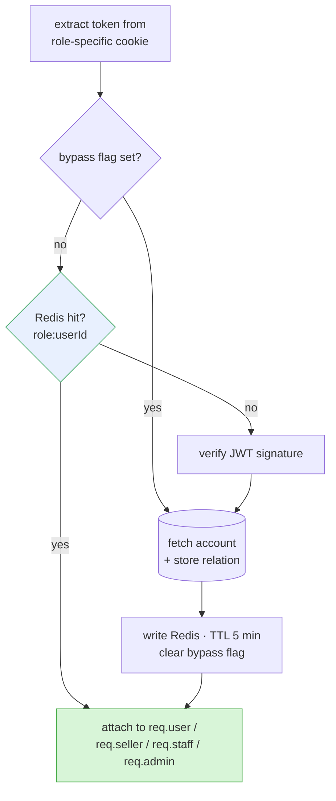

The **bypass flag** is set when a seller is approved or staff access changes — it
forces exactly one fresh DB read, then re-caches. Without it, a revoked seller would
keep working for up to 5 minutes.

| Guard | Allows |
|---|---|
| `isAuthenticated` | any valid JWT |
| `isAdmin` / `isSeller` / `isStaff` / `isUser` | exact role |
| `isSellerOrStaff` | seller as self, or staff with seller context |
| `allowRoles(...roles)` | explicit list |

### OTP login

```mermaid
sequenceDiagram
    autonumber
    actor U as Customer
    participant A as auth-service
    participant R as Redis
    participant Q as RabbitMQ
    participant M as MongoDB

    U->>A: POST /send-otp
    A->>R: mget lock · spam-lock · cooldown
    Note over A,R: one round trip, not three
    alt any restriction set
        A-->>U: 429 rate limited
    else
        A->>R: SETEX otp:<id> (TTL)
        A->>Q: OTP_QUEUE
        Q-->>U: SMS (Fast2SMS) or email
    end

    U->>A: POST /verify-otp
    A->>R: GET otp + attempts
    alt mismatch
        A->>R: incr attempts; lock 30 min after 3
        A-->>U: 400 invalid
    else match
        A->>R: DEL otp key
        A->>M: upsert user
        A-->>U: HTTP-only JWT cookies
    end
```

OTPs live **only** in Redis — a Redis outage blocks customer login entirely. See
[Failure Handling](#failure-handling). Comparison is timing-safe.

**Seller signup** is gated differently: an admin issues a single-use
`SignupAccessCode` with an expiry, auto-cleaned by cron.

---

## Checkout Consistency

Stock lives in MongoDB and orders live in PostgreSQL, so a checkout spans two
databases that cannot share a transaction. Four mechanisms cover the gaps.

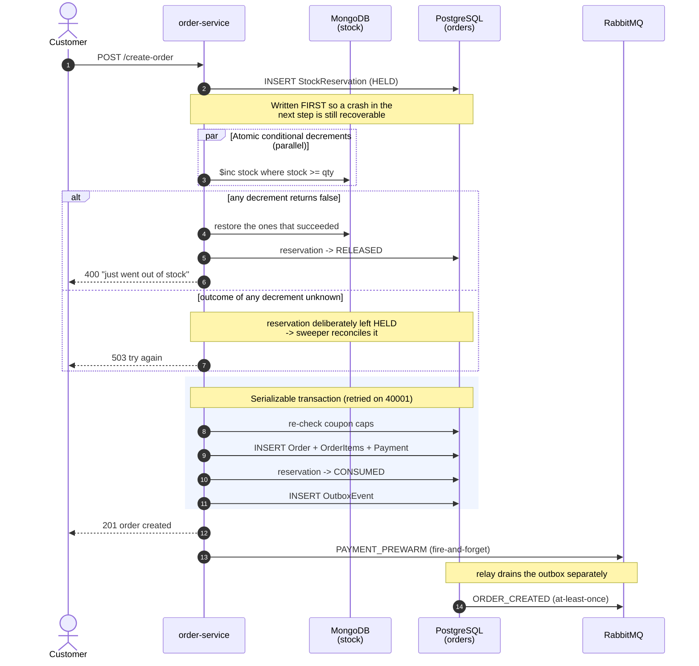

Every step before the transaction is idempotent-safe on replay; everything inside it
rolls back together. The reservation row is what makes the gap between the two
databases recoverable.

### Stock reservation

Stock is decremented in Mongo **before** the Postgres order is created — the reverse
would let us sell stock we never held. That leaves a window where a crash loses the
only record of the decrement, so a `StockReservation` row is written first and marked
`CONSUMED` inside the order transaction. A sweeper (every 5 minutes, Redis-locked)
restores anything left `HELD` past a 15-minute grace period.

Decrements run in parallel and each is a single-document conditional update
(`$inc` guarded by `stock >= quantity`), so overselling is impossible even under
concurrent checkouts. If any decrement's outcome is *unknown* — a rejected promise
may still have been applied by Mongo — the reservation is deliberately left `HELD`
for the sweeper rather than released, since releasing it would strand a decrement
that did land.

### Serializable transaction with retry

The order transaction runs at `Serializable` isolation, which is what stops two
people spending the last use of a coupon. Serializable does not avoid conflicts —
it *reports* them, aborting one transaction. Without a retry that abort reaches the
customer as a failed checkout, so `runSerializable`
(`packages/db-postgres/src/transaction.ts`) retries `P2034` / SQLSTATE `40001` up to
three times with exponential backoff and **full jitter**, so two transactions that
just collided don't retry in lockstep. Business errors thrown by the callback are
never retried.

Retrying only the Postgres side is safe: the Mongo decrement and the reservation row
happen before it and survive replay untouched.

### Transactional outbox

Publishing to RabbitMQ after a Postgres commit is a dual write — if the process dies
in between, the message is gone and nothing knows. Instead the event is written as a
row in the *same* transaction as the state change, and the relay in worker-service
publishes it afterwards.

The relay claims rows with `FOR UPDATE SKIP LOCKED` and a `lockedAt`/`lockedBy`
lease, so two worker instances take disjoint batches instead of double-publishing.
Delivery is **at-least-once** — consumers must be idempotent.

### Webhook durability

Gateway webhooks are persisted to `WebhookEvent` before being applied, deduped on
`(provider, eventId)`. Dedupe keys off `processedAt` rather than mere row existence,
so an attempt that failed doesn't block the gateway's retry. Dedupe used to live only
in Redis on a TTL — a cache, not an audit trail, where a replay after eviction would
re-apply the payment.

### Payment path

Two independent routes can settle an order: the customer returning from the Razorpay
modal, and the webhook. Both converge on the same state, and either can arrive first.

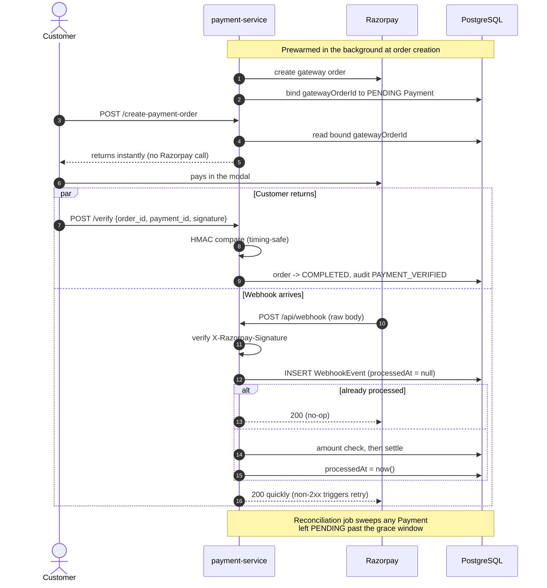

The amount is compared in **integer paise** derived from a `Decimal`, not a float —
`449.35 * 100` in binary floating point is `44934.999999999996`, which is one
representation away from failing its own equality check.

---

## Performance: Where & How

Every technique exists to make a 30-minute delivery promise *feel* like one. Grouped
by where the latency actually goes.

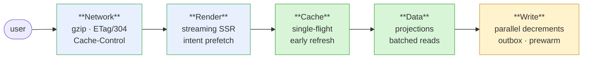

| # | Technique | Mechanism | Wins |
|---|---|---|---|
| 1 | **Streaming SSR** | Static shell renders immediately; each `<Suspense>` island streams as its promise resolves | FCP instant; LCP unblocked by unrelated data |
| 2 | **Intent prefetch** | `router.prefetch()` on `ProductCard` hover — 200-400 ms of human hover-to-click | Navigation feels 0 ms |
| 3 | **Redis caching** | Search 3 min · suggestions 5 min · auth tokens 5 min; `SCAN`-based invalidation on product writes | Skips Mongo on the hot path |
| 4 | **Meilisearch** | Typo tolerance, custom ranking, Mongo regex fallback | Sub-10 ms queries |
| 5 | **Circuit breaker** | Opens after 5 failures, 30 s cooldown, HALF_OPEN probe | Fails fast instead of cascading |
| 6 | **Retry + backoff** | `min(initial × 2^n, max)` on transient errors | Absorbs network blips |
| 7 | **Persistent WS** | One connection held across route changes via React context | No reconnect per page |
| 8 | **Catalog + variant** | One canonical record, thin per-seller variants (diagram below) | One listing per fish; dedup search |
| 9 | **Single-flight cache** | Two-expiry envelope; stale served while one lock-winner refreshes (diagram below) | 50 concurrent misses → **1** query |
| 10 | **Projections** | `select` not `include` — 17 fields instead of 42 per variant row | Also stopped fetching seller password hashes |
| 11 | **ETag + Cache-Control** | Express emits weak ETags; `publicCache()` adds `max-age` + `stale-while-revalidate` on 2xx only | 304s, then no request at all |
| 12 | **Compression** | Every service runs `compression()`; gateway deliberately doesn't — it streams the gzipped body through | 41,901 → 1,183 bytes |
| 13 | **Batched I/O** | One query per table + in-memory map; `updateMany` per batch; `mget` for OTP flags; concurrent uploads | Kills N+1 |
| 14 | **Prewarmed payments** | Gateway order created in background at checkout, before Pay is tapped | Removes a Razorpay round trip from the tap |
| 15 | **Turbopack** | `next dev --turbo` | Sub-100 ms HMR |
| 16 | **Soft delete** | `isDeleted` + hourly hard-delete cron | Fast writes, undo window |

### Catalog + variant merge

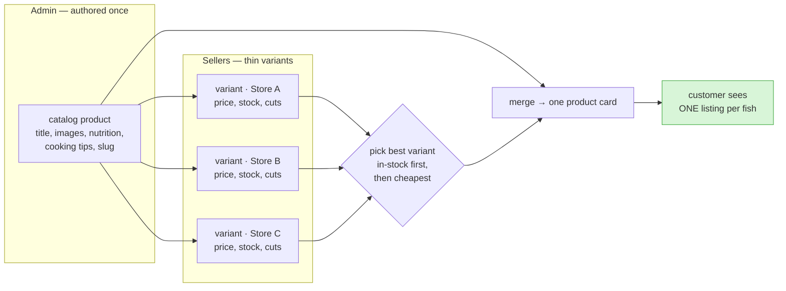

Descriptive content comes from the catalog root; price, stock and availability from
the chosen variant — which is why the variant query is a narrow `select`. Pulling
nutrition and cooking tips per variant fetches the same text once per store, then
throws all but one copy away.

### Single-flight cache

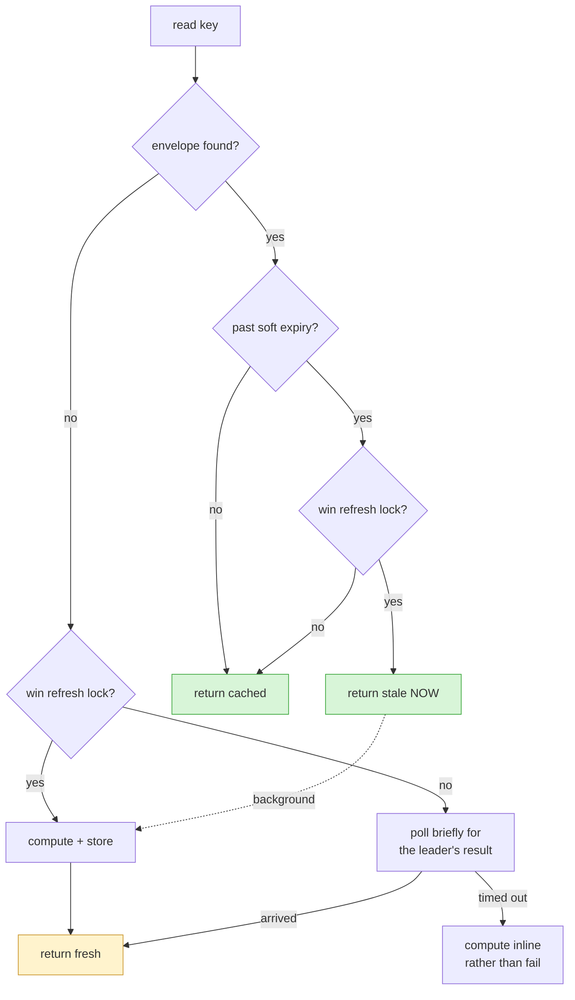

Green returns without touching the database. The only caller that pays for the query
is the lock winner — and past the soft expiry even *it* doesn't wait, because the
refresh runs behind an already-sent response.

| Measured | Result |
|---|---|
| 50 concurrent cold misses | **1** compute, all callers same value |
| Soft-expired read | ~50 ms vs 120 ms for the query |

---

## Real-Time WebSockets

The worker service runs a raw **ws** library WebSocket server (not Socket.io — lower overhead).

### Room-Based Broadcasting

On connect, clients pass query params (`?storeId=xyz&userId=abc`). The `SocketManager` class assigns each `WebSocket` instance to rooms (properties on the socket object). Broadcasting iterates connected clients and filters by room ID — no client ever receives another's messages.

```
Seller connects: ws://...?storeId=abc
  → New order placed → broadcastToStore("abc", "NEW_ORDER", order)
  → Only the seller tab for store "abc" receives it

Customer connects: ws://...?userId=123
  → Seller updates order → broadcastToUser("123", "ORDER_STATUS_UPDATE", status)
  → Only that customer's tab receives it
```

### Heartbeat

Every 30 seconds the server sends a `ping`. If a client doesn't respond with `pong`, it's marked stale and terminated. Prevents ghost connections from accumulating.

### RabbitMQ → WebSocket Pipeline

There are deliberately **two** paths onto the queue, with different guarantees.

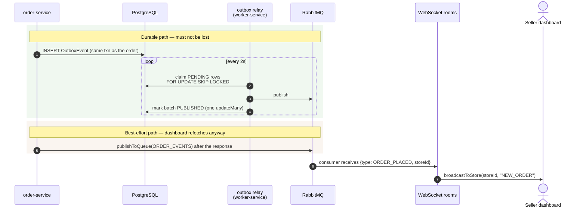
